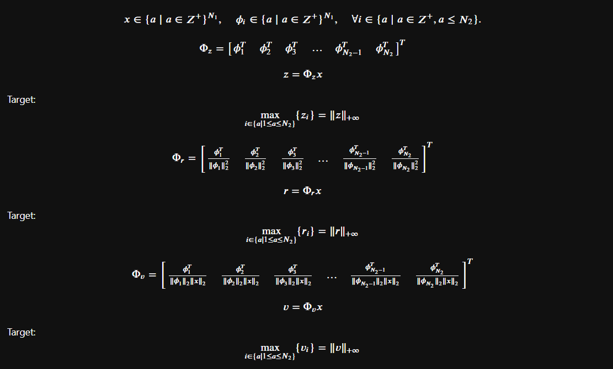

# searchEngine
A search engine for word space

$x$ is an $N_1$-dimensional column vector representing an input sentence, where each element denotes the count of an English word in the sentence.

$\phi_i$ is an $N_1$-dimensional row vector representing a transcript in a corpus, where each element denotes the count of an English word in that transcript.

$N_1$ is the number of words in vocabulary, and $N_2$ is the number of transcripts in corpus.

